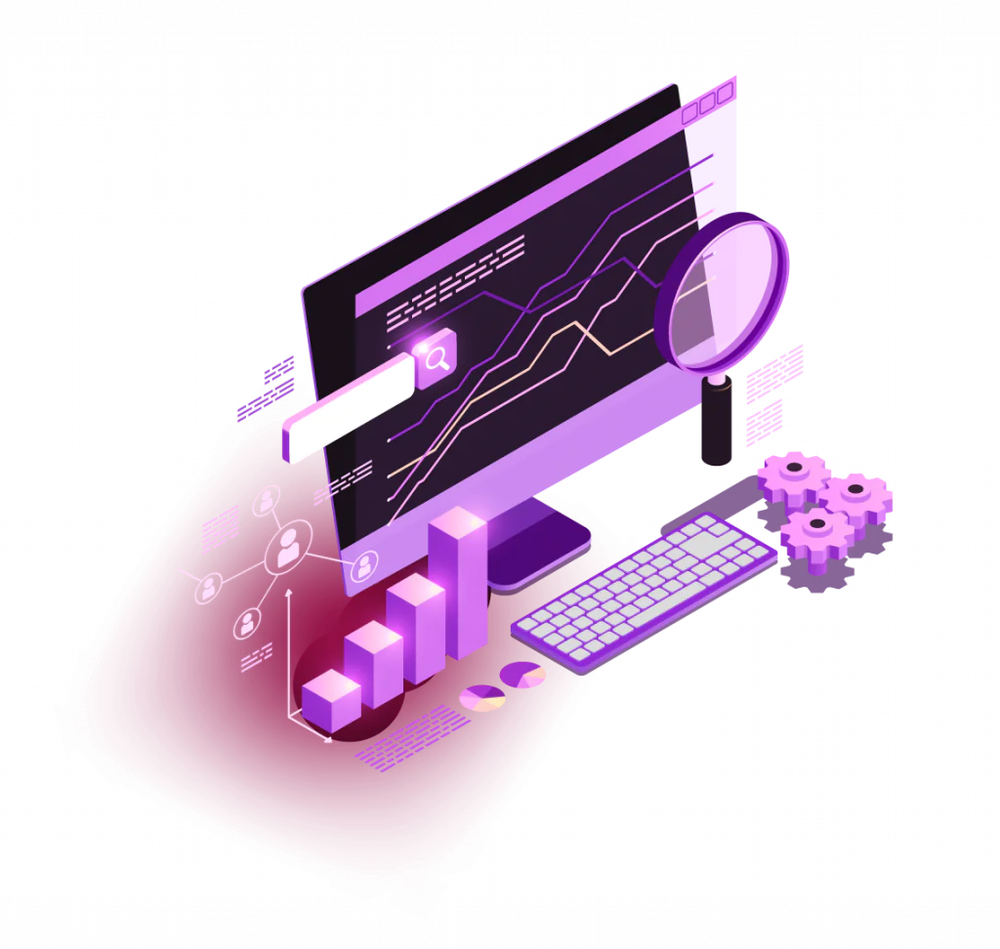

### Olá! Me chamo Samuel Lucas 👋

  Estudante de <strong>Ciência da Computação</strong> na PUC-Minas, focado em se tornar desenvolvedor web Fullstack. Tenho direcionado meus estudos para <strong>React</strong>, <strong>Java</strong> e <strong>C</strong>, aplicando cada aprendizado em projetos práticos que fortalecem minha jornada em programação.   
  Busco criar soluções modernas, funcionais e com propósito, sempre com a mentalidade de aprender construindo.

## Sobre mim

- 🎓 Estudante de **Ciência da Computação** na **PUC-Minas**
- 💻 Focado em **desenvolvimento Fullstack** com React, Java e C
- 📈 Buscando evoluir constantemente por meio de projetos práticos
- 🧠 Mentalidade: transformar teoria em prática

---

 

 Atualmente curso <strong>Ciência da Computação</strong> na PUC-Minas e sigo construindo meu caminho na área de <strong>Desenvolvimento Fullstack</strong>.    Tenho dedicado meus estudos a <strong>React</strong> no front-end e a linguagens como <strong>Java</strong> e <strong>C</strong> no back-end, sempre reforçando minha base em lógica e fundamentos de programação. Além disso, gosto de explorar novas ferramentas e tecnologias, aplicando cada aprendizado em projetos pessoais e acadêmicos.    Vejo a prática como a melhor forma de evoluir: transformar ideias em código e desafios em oportunidades de crescimento 🚀 

###

---
<picture>
  <source media="(prefers-color-scheme: dark)" srcset="https://raw.githubusercontent.com/samuellucasrodrigues/samuellucasrodrigues/output/pacman-contribution-graph-dark.svg">
  <source media="(prefers-color-scheme: light)" srcset="https://raw.githubusercontent.com/samuellucasrodrigues/samuellucasrodrigues/output/pacman-contribution-graph.svg">
  
</picture>

###

## ⭐ GitHub Stats

<table>
  <tr>
    <td></td>
    <td></td>
  </tr>
</table>

---

## 💻 Tecnologias e linguagens 

### 🚀 Frameworks e bibliotecas

### 🛠️ Ferramentas de desenvolvimento

---

### 📩 Entre em contato!

 

